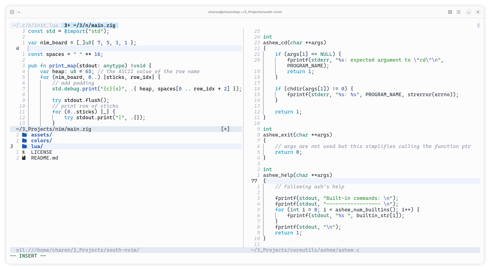
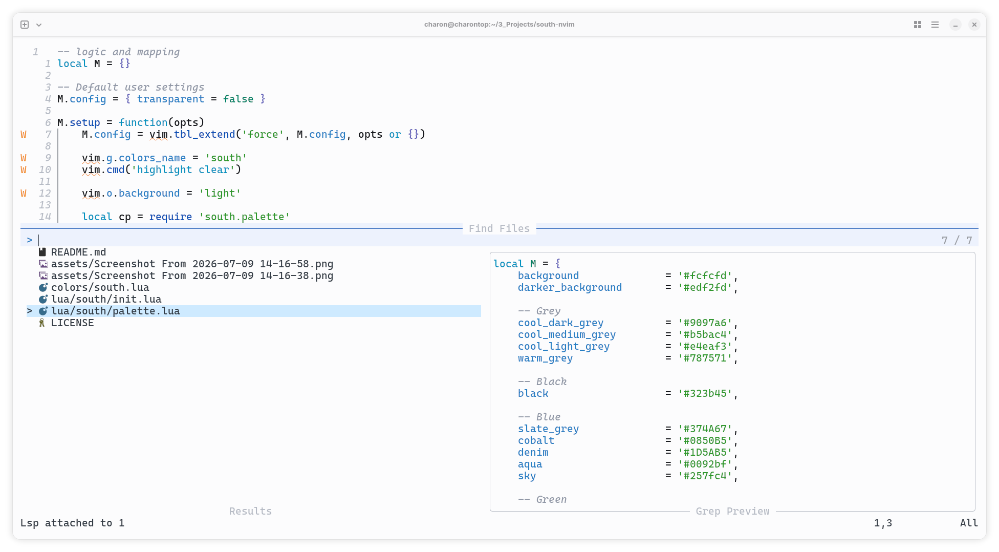

# South theme for Neovim

A bright, summery ~Emacs~ Neovim theme 🌱☀️🌊

> This is a Neovim port of the original Emacs
> [south](https://github.com/SophieBosio/south) theme. All credit goes to
> Sophie Bosio, thanks for creating this lovely theme.

## Installation and configuration

### Using neovim 0.12+'s native `vim.pack`:

```lua
vim.pack.add({
    { src = 'https://github.com/arnauKL/south.nvim' }
})
vim.cmd.colorscheme('south')
```

### Using `lazy.nvim` (Neovim 0.7+)

```lua
{
    "arnauKL/south.nvim",
    lazy = false,
    priority = 1000,
    config = function()
        -- Optional configuration goes here
        vim.cmd.colorscheme('south')
    end
}
```

Right now, the only available configuration is a setting for
transparent backgrounds. It is set to `false` by default.

```lua
require 'south'.setup({
    transparent = true
})
```

## Supported plugins

I've only added support for the plugins I use:

- Telescope.nvim
- Oil.nvim

Everything else falls back to editor highlights. If you'd like to add support
for other plugins, feel free to submit a PR.

## Screenshots

Some zig and C with oil.nvim:



Some lua and telescope.nvim:


